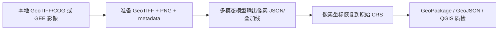

# 通用多模态遥感矢量化工具

以下命令默认在 `D:\easyGEE\tools\multimodal_geo_vector` 目录执行；也可以把脚本名替换为绝对路径。

这套工具把“遥感影像 → 多模态目标识别 → CRS 矢量”拆成可复用的四段：



支持田块、车辆、树冠、建筑、水体或其他目标。目标类别不写死，区别只体现在提示词、几何类型和清洗阈值。

## 1. 输入路径

### 本地带地理参考影像

输入必须是带 CRS 和 affine transform 的 GeoTIFF/COG。普通 JPG/PNG 没有地理参考时，需要先配准或提供世界文件与 CRS。

```powershell
python prepare_imagery.py local `
  --input D:\data\scene.tif `
  --output-dir D:\data\prepared `
  --bands 1,2,3 `
  --name scene
```

输出：

- `scene_preview.png`：给多模态模型看的预览图；
- `scene.metadata.json`：像元尺寸、CRS、transform、范围和波段记录。

### GEE 影像

先按 AOI 内有效像元比例和局部云质量选择一景近期清晰影像：

```powershell
python select_recent_gee_scene.py `
  --project <cloud-project-id> `
  --center <lon,lat> --radius-km <km>
```

再用返回的 `selected_image_id` 准备可追溯的单景影像：

```powershell
python prepare_imagery.py gee `
  --project <cloud-project-id> `
  --output-dir <prepared-dir> `
  --region <xmin,ymin,xmax,ymax> `
  --image-id <selected-image-id> `
  --bands B4,B3,B2 `
  --scale <metres> --crs <EPSG:code> --scale-factor 0.0001 `
  --name <scene-name>
```

GEE 负责目录筛选、合成和导出；本地脚本负责预览、提示词和矢量化。任意 GEE 数据集都应明确波段、缩放因子、时间范围、AOI、分辨率和 CRS，不能默认套用 Sentinel-2 的比例因子。

## 2. 多模态标注协议

生成目标提示词：

```powershell
python prompt_template.py `
  --image D:\data\prepared\scene_preview.png `
  --target "车辆" `
  --geometry polygon `
  --constraints "只标注可分开的车辆，不标注道路、建筑、阴影和车辆反光"
```

模型应返回 JSON，而不是直接返回经纬度：

```json
{
  "image_size": [1600, 1200],
  "coordinate_space": "pixel",
  "objects": [
    {
      "id": "car_001",
      "label": "车辆",
      "geometry_type": "polygon",
      "confidence": 0.88,
      "vertices": [[412, 305], [438, 300], [444, 318], [418, 323]]
    }
  ]
}
```

支持：

- `polygon`：田块、树冠、建筑、车辆轮廓；
- `bbox`：车辆、船只等矩形目标；
- `point`：目标中心点；
- `line`：道路、河流、田埂等线状目标。

坐标可以是 `pixel`，也可以是 0–1 的 `normalized`。程序会根据 GeoTIFF 的宽高和 transform 还原到地图坐标。

## 3. 矢量化与清洗

### JSON 直接转 CRS 矢量

```powershell
python vectorize_annotations.py json `
  --annotations D:\data\prepared\scene_annotations.json `
  --raster D:\data\prepared\scene.tif `
  --output-stem D:\data\results\scene_targets `
  --min-area 10 `
  --simplify 1
```

输出按几何类型拆分：

- `scene_targets_polygons.gpkg` / `.geojson`；
- `scene_targets_lines.gpkg` / `.geojson`；
- `scene_targets_points.gpkg` / `.geojson`；
- `scene_targets_boundaries.gpkg`：面边界线层；
- `scene_targets_manifest.json`：数量、CRS 和文件清单。

### 只有模型叠加线时

如果模型只能返回一张带颜色轮廓线的图片，可使用颜色提取作为备用路径：

```powershell
python vectorize_annotations.py overlay `
  --overlay D:\data\prepared\scene_overlay.png `
  --raster D:\data\prepared\scene.tif `
  --output-stem D:\data\results\scene_overlay `
  --color cyan --dedupe-px 10
```

JSON 坐标优先于颜色线提取，因为颜色线可能有抗锯齿、重复内外轮廓和模型改写像素的问题。

## 4. 大影像与小目标

车辆、单木树冠等目标不宜把整景压缩成一张预览图。先切片，并使用有重叠的窗口：

```powershell
python tile_imagery.py `
  --input D:\data\scene.tif `
  --output-dir D:\data\tiles `
  --tile-size 512 --overlap 128
```

每个 tile 的多模态 JSON 保存为 `tile_0001.json` 等，然后合并：

```powershell
python merge_tile_annotations.py `
  --manifest D:\data\tiles\tiles_manifest.json `
  --annotations-dir D:\data\tile_annotations `
  --output D:\data\scene_annotations.json `
  --iou-threshold 0.5
```

程序会把 tile 局部坐标加回全图坐标，并对重叠窗口中的同类目标做简单非极大值去重。

输出后生成边界叠加质检图：

```powershell
python render_vector_qa.py `
  --raster <reference.tif> `
  --vector <targets_polygons.gpkg> --layer polygons `
  --output <qa_overlay.png>
```

## 5. QGIS 使用

优先加载 `*_boundaries.gpkg` 检查轮廓；需要面分析时加载 `*_polygons.gpkg`。面图层如果看起来“糊成一片”，在“图层属性 → 符号系统”中把填充设为透明，只保留轮廓线。

GeoPackage 保留输入影像的原生 CRS，GeoJSON 统一输出为 EPSG:4326。QGIS 可以动态重投影，但面积、距离分析应使用合适的米制投影。

## 6. 适用边界

- 多模态结果是候选标注，不自动等于测量真值；应保存 prompt、模型版本、影像日期和人工复核记录。
- 小目标、遮挡目标、极低分辨率目标和相互接触的目标需要切片、重叠窗口和独立质检。
- 若输入 JPG/PNG 无 CRS，程序会拒绝直接导出地图矢量，避免产生“看似有坐标、实际错位”的结果。

本工具采用 `hybrid` 路由：EasyGEE 负责 GEE/导出，Rasterio/GeoPandas 负责本地 CRS 和矢量，视觉模型负责候选目标解释。方法参考了 GeoAI 的 VLM、窗口化推理、像素到地图空间化和 QGIS 质检规范。
